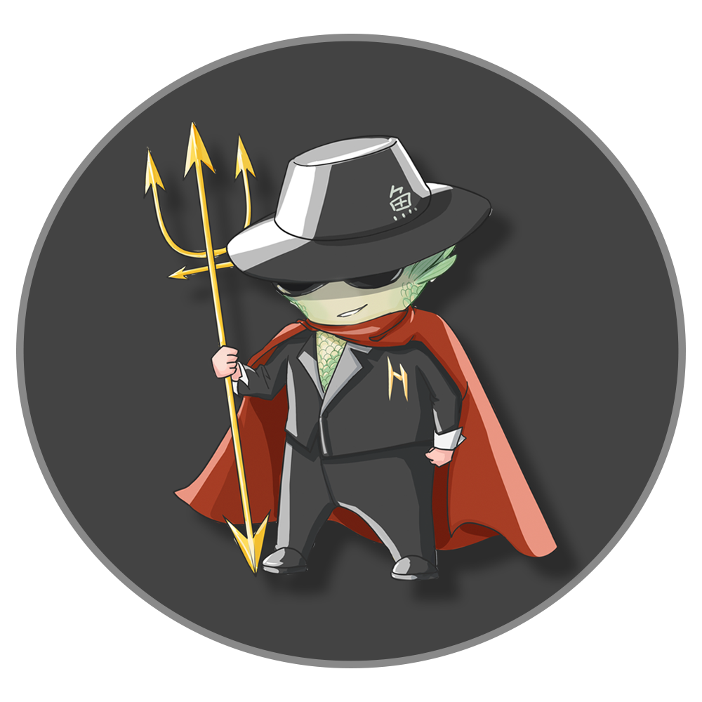
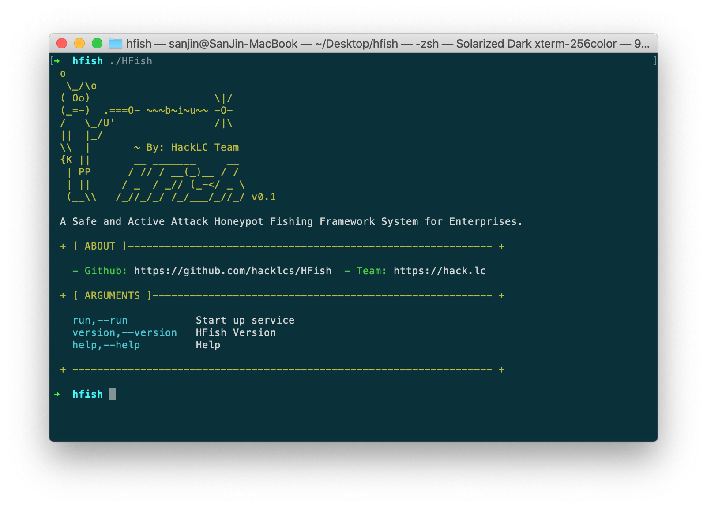
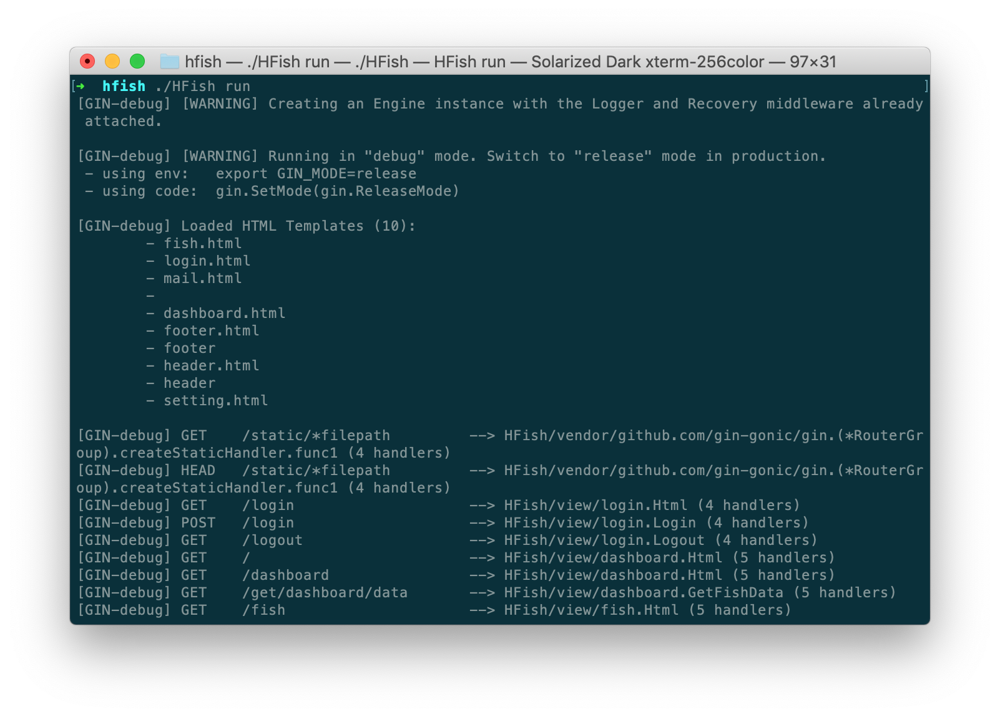
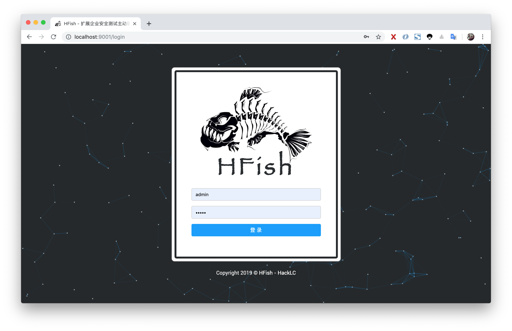
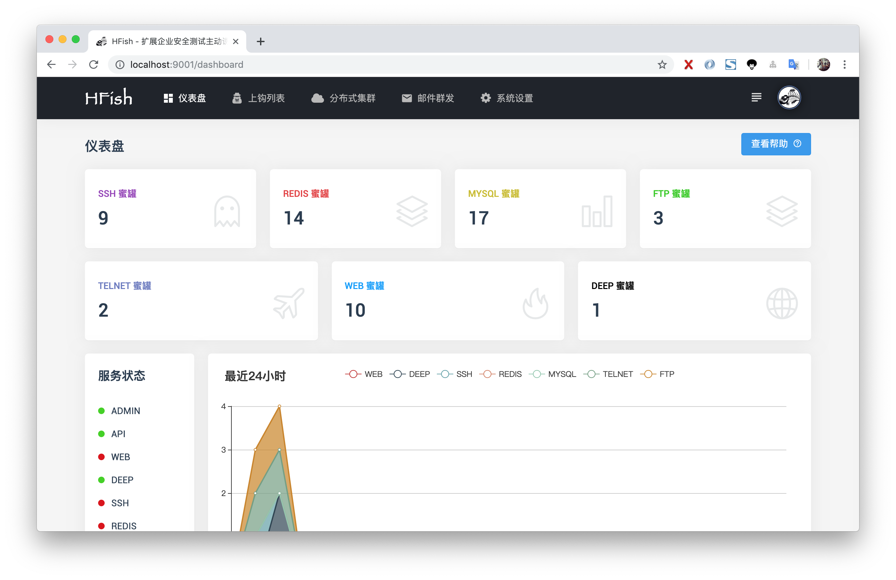
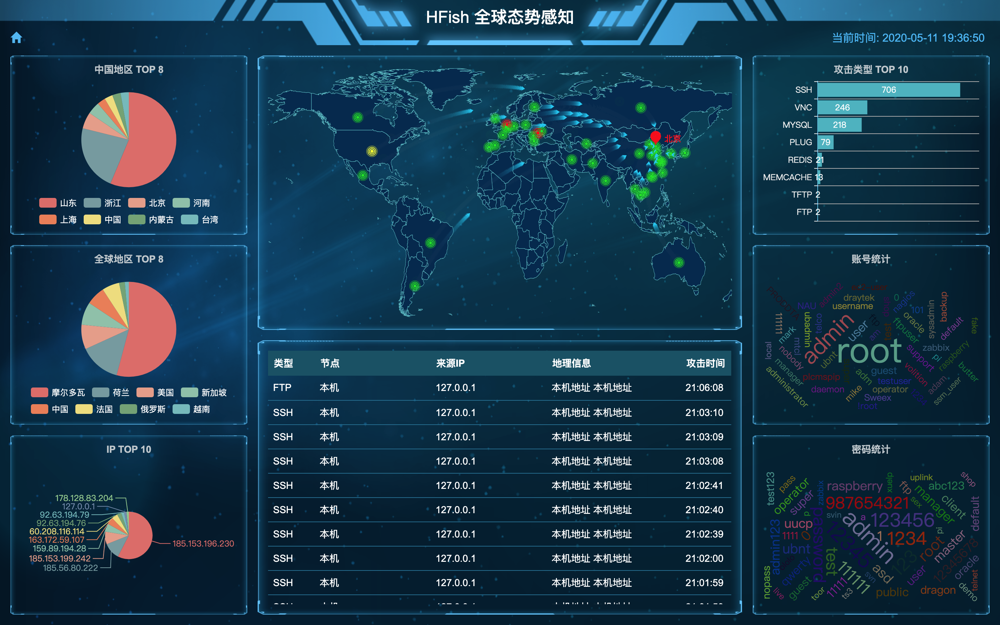
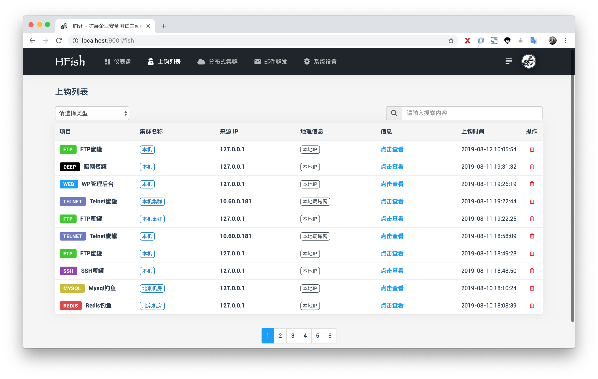
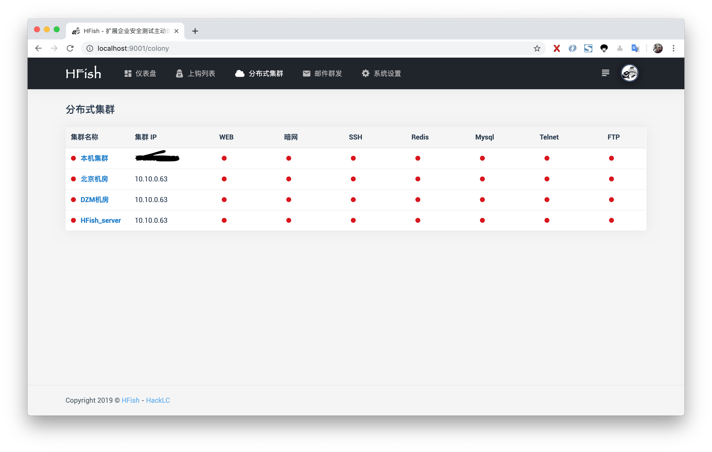
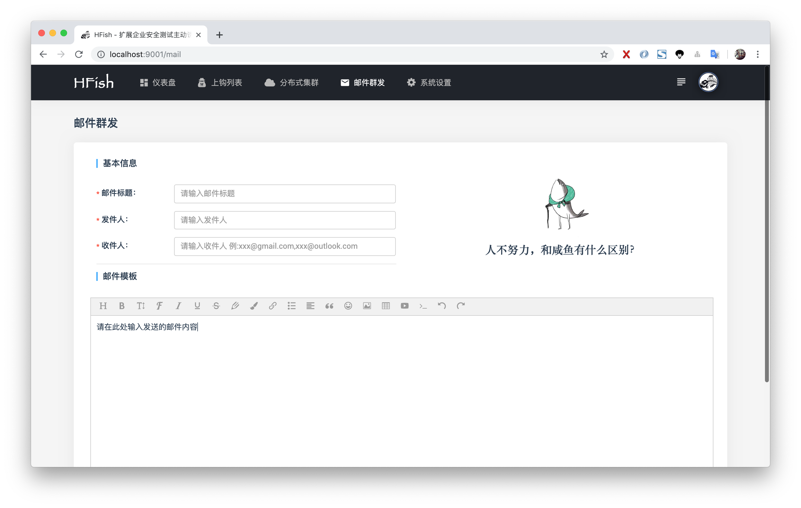
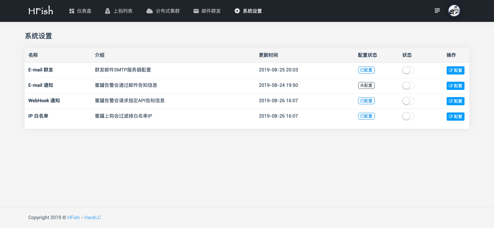

  

<h1 align="center">HFish </h1>

A Most Convenient Honeypot Platform

<a href="https://hfish.io/docs/#/" target="_bank">Document</a>
|
<a href="https://github.com/hacklcx/HFish" target="_bank">Github</a>
|
<a href="https://gitee.com/lauix/HFish" target="_bank">Gitee</a>
|
<a href="https://github.com/hacklcx/HFish/releases" target="_bank">Download</a>
|
<a href="README_CN.md" target="_bank">中文</a>

## Introduce

**HFish** It is a cross platform honeypot platform developed based on golang, which has been meticulously built for enterprise security

- **Multi-function**： Not just support `HTTP(S)` Pot，It also supports `SSH`、`SFTP`、`Redis`、`Mysql`、`FTP`、`Telnet`、`Deep` etc.
- **Expansibility**： Provide `API` Interface，Users can expand honeypot module at will ( `WEB`、`PC`、`APP` )
- **Convenience**： Use **Golang** Development , Users can
 `Win` + `Mac` + `Linux` Quickly deploy a honeypot platform on

## Support honeypot

- **`SSH`** Pot
- **`Redis`** Pot
- **`Mysql`** Pot
- **`MemCache`** Pot
- **`Telnet`** Pot
- **`FTP`** Pot
- **`WEB`** Pot
- **`Deep`** Pot
- **`HTTP`** Pot
- **`TFTP`** Pot
- **`VNC`** Pot
- **`ES`** Pot
- **`Custom`** Pot

## Rapid deployment

- Download current system binary compression package
- **`cd`** To program root , Update **`config.ini`** file
- Implement **`./HFish run`** Start service
- Browser input **http://localhost:9001** open

## Partial interface display

### Help

### Start service

### Landing page

### Dashboard

### Situational awareness

### Upper hook page

### Distributed cluster

### Mass mailing

### settings page

## About

> I'm the only one right now

**Team：** HackLC

**Website：** https://hack.lc

**Focus on the safety industry, focus on building good products**

## Contact me

**E-mail:** **`lauixData#gmail.com`**