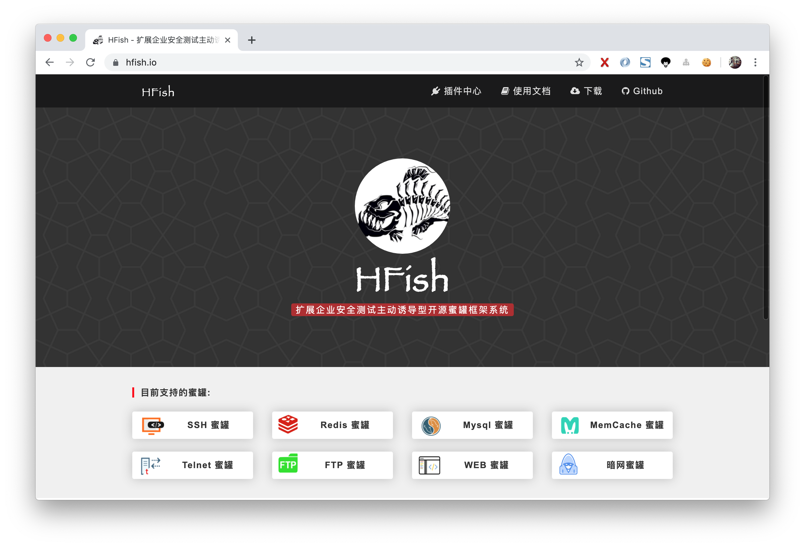

# 介绍

> 本项目使用 **GPL** 协议，未经授权，禁止使用商业用途。
>
> *本 Team 研发此平台，仅为企业安全测试使用，禁止其他人员使用非法用途！一切行为与本 Team 无关。*

**HFish** 是一款基于 Golang 开发的跨平台多功能主动诱导型蜜罐框架系统，为了企业安全防护测试做出了精心的打造

- 多功能 不仅仅支持 HTTP(S) 蜜罐，还支持 SSH、SFTP、Redis、Mysql、FTP、Telnet、暗网 等
- 扩展性 提供 API 接口，使用者可以随意扩展蜜罐模块 ( WEB、PC、APP )
- 便捷性 使用 Golang 开发，使用者可以在 Win + Mac + Linux 上快速部署一套蜜罐平台

# 地址

## HFish 官方

- 官网: https://hfish.io
- 使用文档: https://hfish.io/docs

## Github

- Git: https://github.com/hacklcx/HFish
- Download: https://github.com/hacklcx/HFish/releases

## 码云(Gitee)

- Git: https://gitee.com/lauix/HFish
- Download: https://gitee.com/lauix/HFish/releases


# 快速部署

## 部署说明

- 下载当前系统二进制包
- cd 到程序根目录，修改 config.ini 配置文件
- 执行 ./HFish run 启动服务
- 浏览器输入 http://localhost:9001 打开

## 命令行帮助


## 启动服务


# 部分界面展示

## HFish 态势感知


## 登录页


## 仪表盘


## 上钩页


## 分布式集群


## 邮件群发


## 设置页


# 部分功能使用演示

## WEB 蜜罐

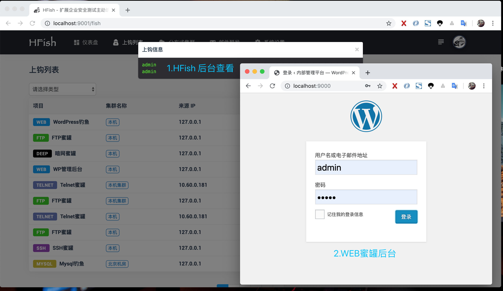

## SSH 蜜罐

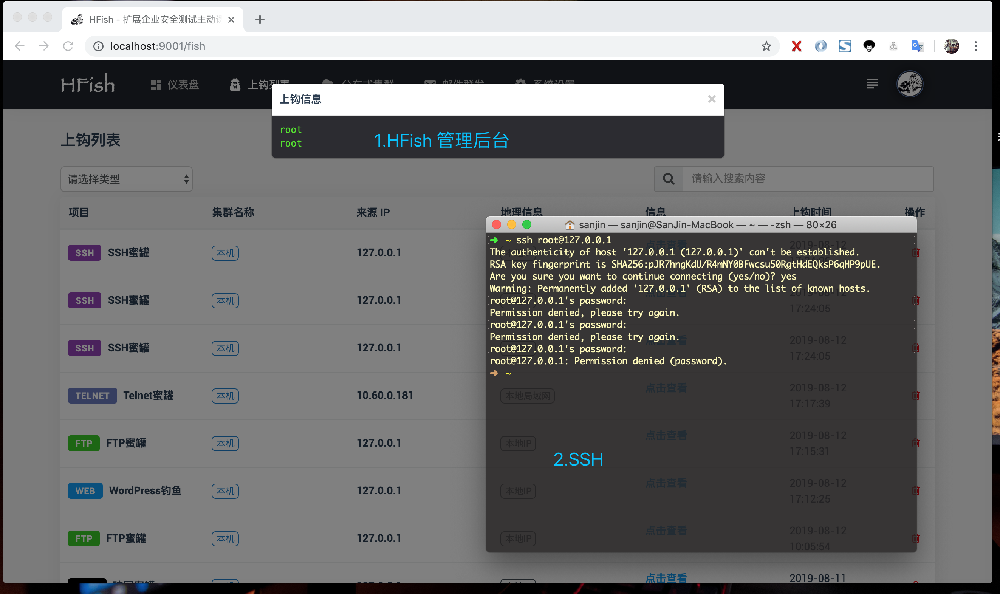

## Redis 蜜罐

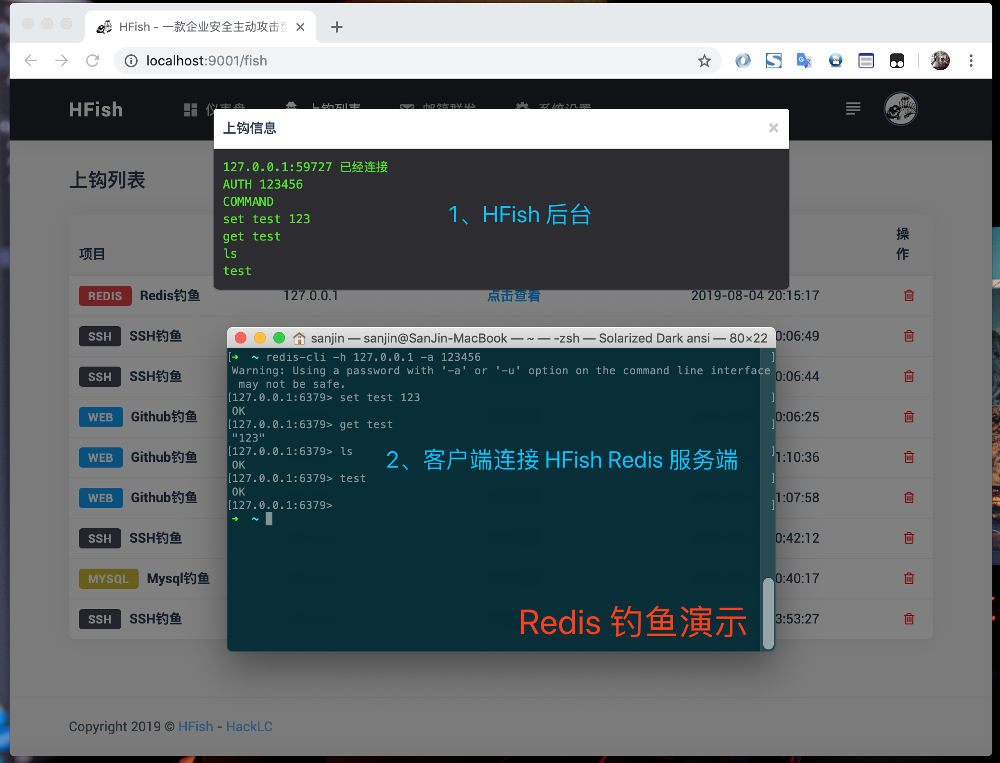

## Mysql 蜜罐

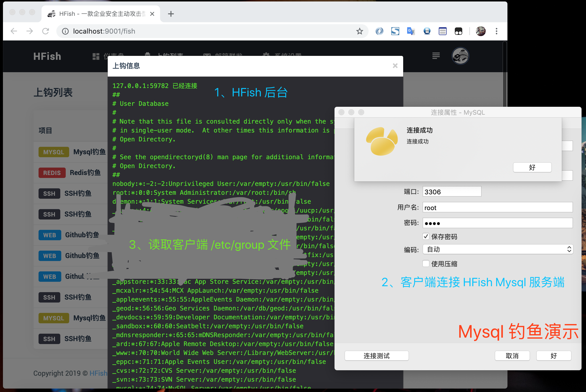

## FTP 蜜罐

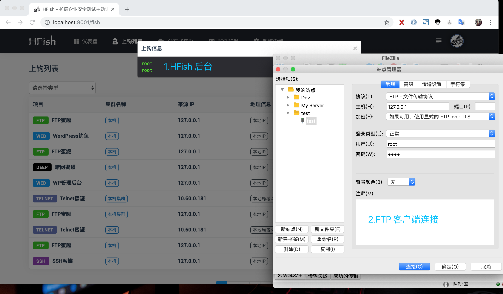

## Telnet 蜜罐

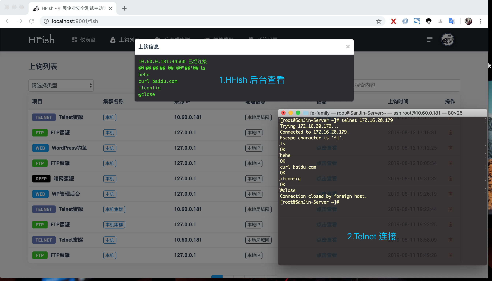

## MemCache 蜜罐

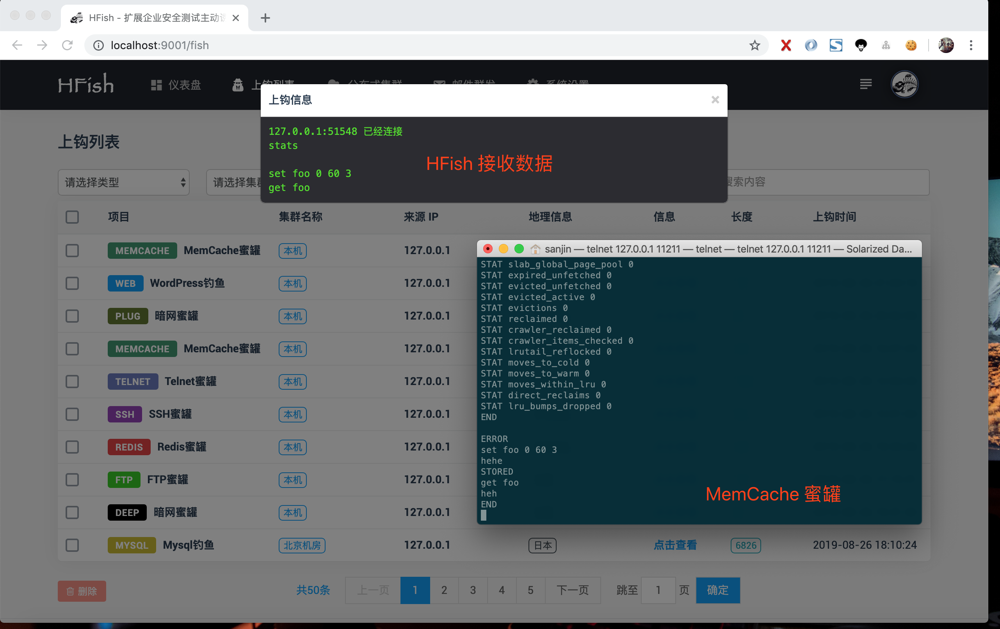

## HTTP 蜜罐

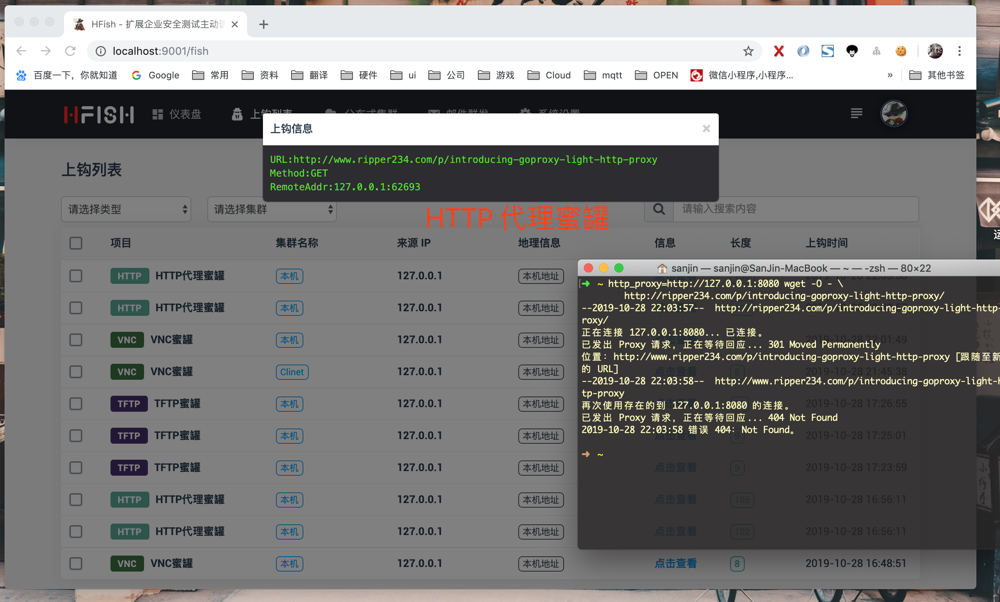

## TFTP 蜜罐

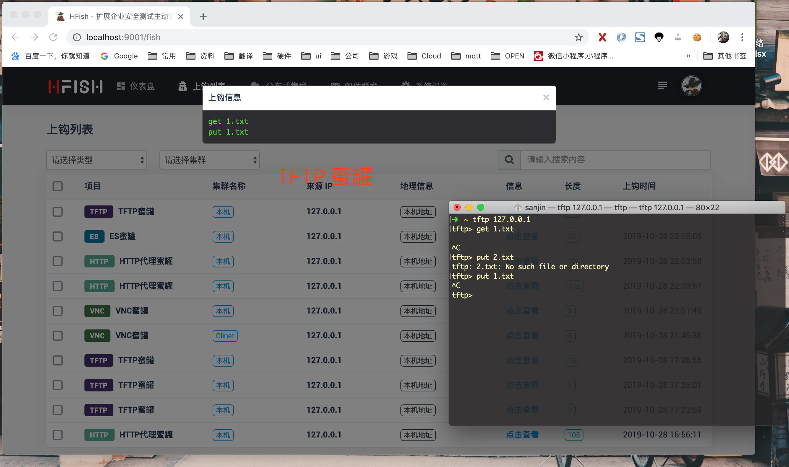

## ES 蜜罐

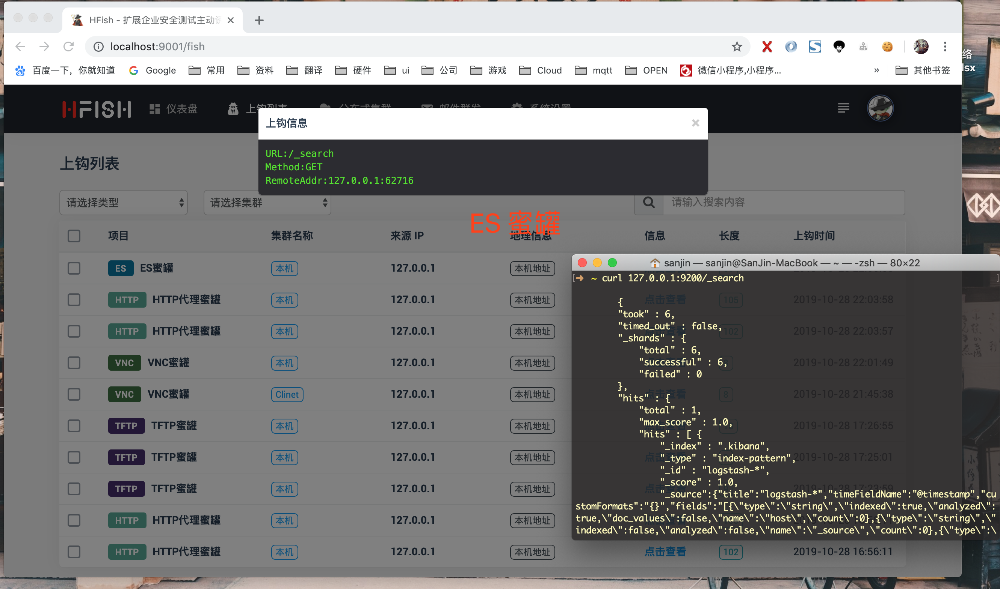

## VNC 蜜罐

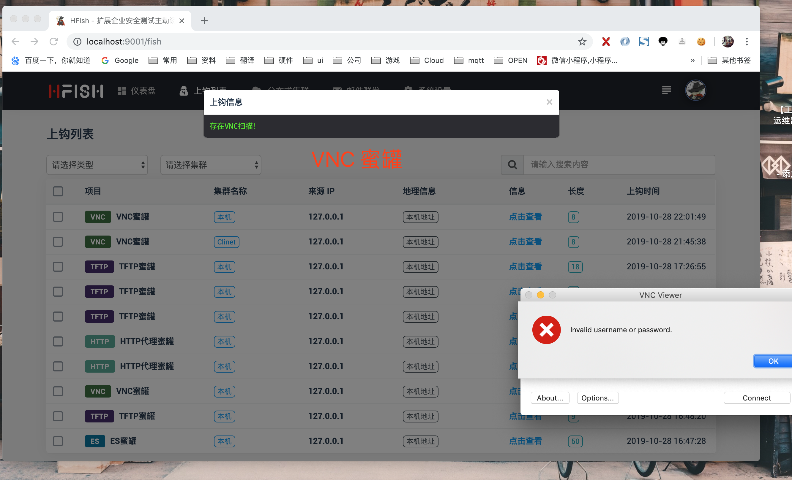


# 注意事项

- 邮箱 SMTP 配置后需要开启方可使用
- API 接口 info 字段，&& 为换行符
- 启动 WEB 蜜罐，请先启动 API 模块
- WEB 插件 需在 WEB 目录下 编写
- WEB 插件 下面必须存在两个目录
- 集群 心跳为60秒,断开显示会延迟60秒

# API 接口

## WEB 蜜罐

```
URL: http://WEB蜜罐地址/api/v1/post/report

POST：

    name    :   WEB管理后台蜜罐                     # 项目名
    info    :   admin&&12345                      # 上报信息，&& 为换行符号
    sec_key :   9cbf8a4dcb8e30682b927f352d6559a0  # API 安全密钥

特殊说明：

    URL api/v1/post/report 可在 config.ini 配置里修改
    sec_key 可在 config.ini 配置里修改，修改后 WEB 模板也需要同时修改
```

## 暗网 蜜罐

```
URL: http://暗网蜜罐地址/api/v1/post/deep_report

POST：

    name    :   暗网后台蜜罐                        # 项目名
    info    :   admin&&12345                      # 上报信息，&& 为换行符号
    sec_key :   9cbf8a4dcb8e30682b927f352d6559a0  # API 安全密钥

特殊说明：

    URL api/v1/post/deep_report 可在 config.ini 配置里修改
    sec_key 可在 config.ini 配置里修改，修改后 暗网 模板也需要同时修改
```

## 黑名单IP

```
URL(Get): http://localhost:9001/api/v1/get/ip?key=585e2ba265d965b1929148d0f0e33133

特殊说明：

    提供此接口为了配合防火墙使用，具体方案欢迎来讨论！
```

## 获取全部钓鱼信息

```
URL(Get): http://localhost:9001/api/v1/get/fish_info?key=585e2ba265d965b1929148d0f0e33133

返回数据格式:

  {
      code: 200,
      data: [
          {
              agent: "本机",
              city: "",
              country: "本机地址",
              create_time: "2019-08-26 21:29:00",
              id: 224,
              info: "127.0.0.1:51548 已经连接&&stats&&&&set foo 0 6",
              ip: "127.0.0.1",
              project_name: "MemCache蜜罐",
              region: "本机地址",
              type: "MEMCACHE"
          }, 
      ],
      msg: "success"
  }

字段说明：

	agent        :    集群名称
	country      : 		国家
	region       : 		省份/地区
  city         : 		城市
	ip           : 		IP 地址
	project_name : 		项目名称
	type 				 :    蜜罐类型
	info 				 :    上钩信息
	id           :    数据库唯一标识
	create_time  :    上钩时间
```

## 获取全部账号密码信息

```
URL(Get): http://localhost:9001/api/v1/get/passwd_list?key=585e2ba265d965b1929148d0f0e33133
```


# 关于

- Team: HackLC
- URL: https://hack.lc

# 反馈群

加微信拉人，请备注 **HackLC**

