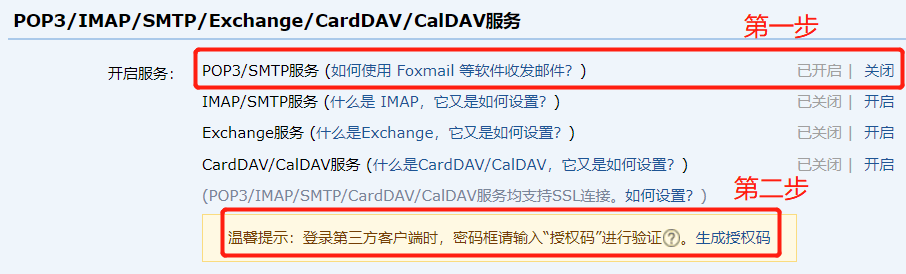
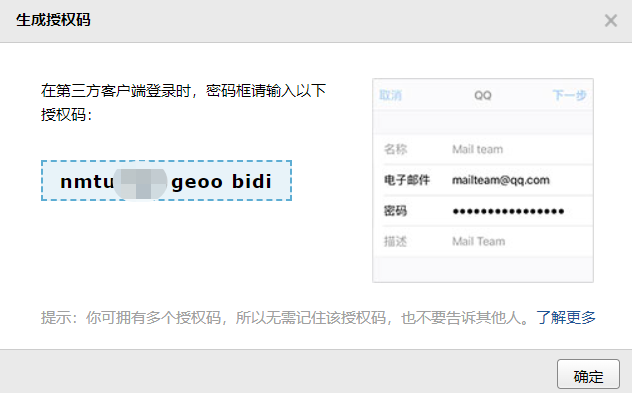
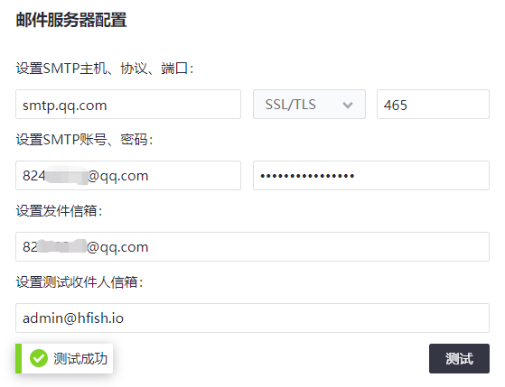

#### QQ信箱配置

该页面介绍如果配置HFish通过QQ信箱发送告警邮件。

> 登录QQ信箱进入设置页面

打开[https://mail.qq.com](https://mail.qq.com/)，登录后进入【设置】页面

> 开启SMTP功能和获取SMTP专用密码

在【设置】页面中下拉找到“POP3/IMAP/SMTP/Exchange/CardDAV/CalDAV服务”段落，如下图：

第一步，开启“POP3/SMTP服务”服务，根据提示进行手机验证；
第二步，点击“生成授权码”，根据提示进行手机验证，获取SMTP专用密码，如下图：

> HFish页面配置

登录HFish，打开【告警配置】-【通知配置】，找到“邮件服务器配置”段落，按照下图填写，点击【测试】：

如果一切正常，系统会提示“测试成功”，用户信箱会收到一封测试邮件。