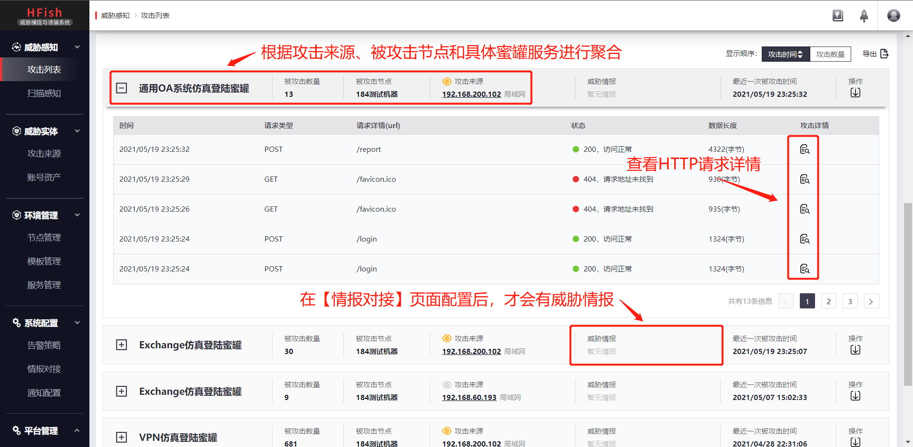
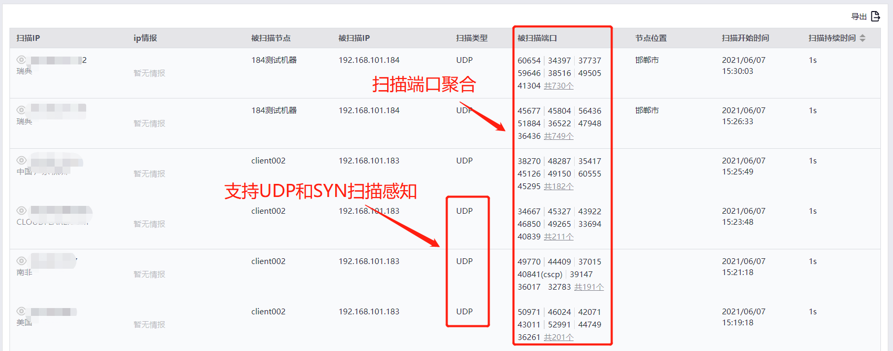
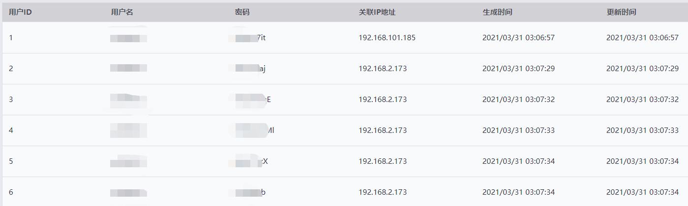
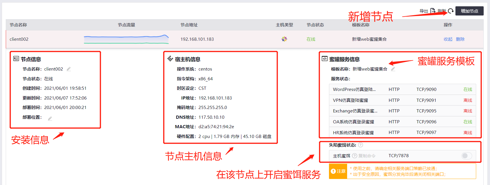
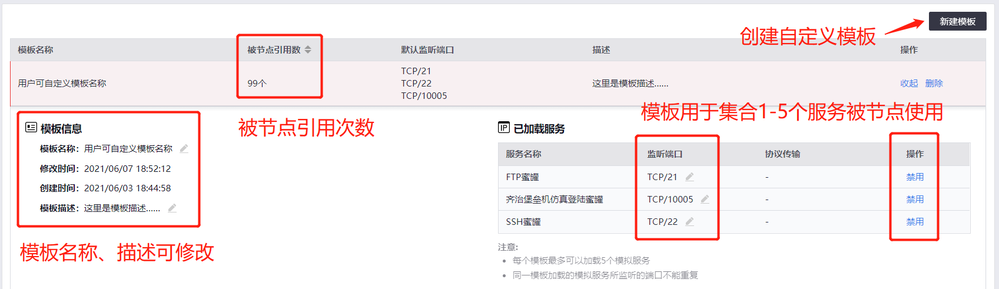
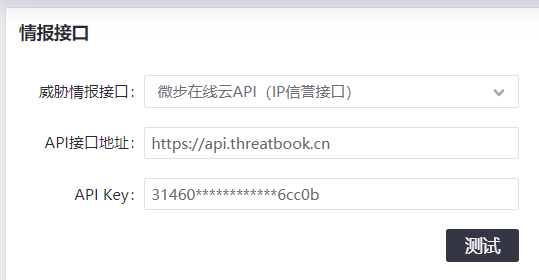
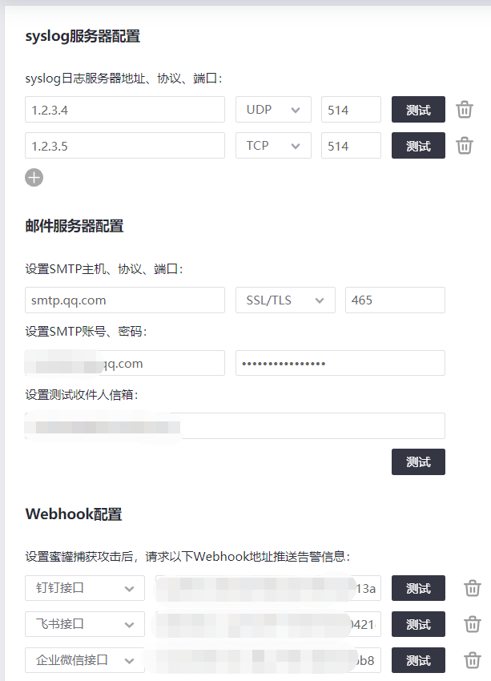

  

<h1 align="center">HFish </h1>

HFish是一款安全、简单可信赖的跨平台蜜罐软件，允许商业和个人用户免费使用。

<a href="https://hfish.io/" target="_bank">官网</a>
|
<a href="https://hfish.io/#/" target="_bank">使用手册</a>
|
<a href="https://github.com/hacklcx/HFish" target="_bank">Github</a>
|
<a href="https://gitee.com/lauix/HFish" target="_bank">Gitee</a>
|
<a href="https://hfish.io/docs/#/download" target="_bank">下载部署</a>

## 二维码

## 特点

+ 安全可靠：主打低中交互蜜罐，简单有效；

+ 蜜罐丰富：支持SSH、FTP、TFTP、MySQL、Redis、Telnet、VNC、Memcache、Elasticsearch、Wordpress、OA系统等10多种蜜罐服务，支持用户制作自定义Web蜜罐；

+ 开放透明：支持对接微步在线X社区API、五路syslog输出、支持邮件、钉钉、企业威胁、飞书、自定义WebHook告警输出；
+ 快捷管理：支持单个安装包批量部署，支持批量修改端口和服务；

+ 跨平台：支持Linux x32/x64/ARM、Windows x32/x64平台；

## 快速开始

[官方网站](https://hfish.io/)：更多使用蜜罐、使用场景和玩法详见官网

[详细文档](https://hfish.io/docs/#/)：更详细的功能说明、故障排错指南

## 架构

HFish由控制端和节点端组成，控制端用来生成和管理节点端，并接收、分析和展示节点端回传的数据，节点端接受控制端的控制并负责构建蜜罐服务。

> 蜜罐工作原理

> 融合在企业网络中

## 注意

+ Linux 安装无需root权限，但是会导致无法监听低于TCP/1024以下端口

+ 控制端使用 TCP/4433 和 TCP/4434 端口，节点端监听端口根据模拟的服务不同而不同

+ 节点端需要可访问控制端的 TCP/4434 端口，控制端不会主动访问节点端

+ 控制端默认用户名/密码：**`admin / HFish2021`**

## 部署控制端

先部署控制端，再通过控制端的Web页面配置节点端，安装包仅包含控制端和节点端，蜜罐服务包需要部署控制端后从 **`服务管理`** 页面联网下载或离线上传

可联网环境：如果用户的环境允许联网，建议使用以下快速部署步骤：

+ Linux 环境：
  + 在shell中运行命令：**`sh | curl https://hfish.io/install.sh`**

+ Windows x64 环境：
  + 下载控制端安装包：请访问下载页面下载相应版本 https://hfish.io/#/download
  + 解压缩后双击 **`server.exe`**

离线部署：如果用户为隔离网络环境，请使用以下部署方式

+ Linux x64 环境：
  + 下载控制端安装包：请访问下载页面下载相应版本 https://hfish.io/#/download
  + 解压缩安装包：**`tar zxvf ./hfish-*-linux-*.tar.gz`**
  + 进入安装目录：**`cd hfish`**
  + 启动控制端：**`nohup ./server &`**

## 配置控制端

新部署的控制端需要没有任何蜜罐服务，必须新增服务和节点，控制端和节点端可以部署在同一台机器上。

+ 新增服务
  + 浏览器中输入 **`https://server_ip:4433/web/`**，登录控制端
  + 进入 **`服务管理`** 页面
  + 如果当前控制端可联网，点击服务表格右侧的下载按钮，并等待服务下载完成
  + 如果当前控制端不可联网，点击右上角 **`新增服务`** 按钮，上传服务包，服务包下载地址： **`http://img.threatbook.cn/hfish/services/services-2.4.0.tar.gz`**

+ 新增节点
  + 浏览器中输入 **`https://server_ip:4433/web/`**，登录控制端
  + 进入 **`节点管理`** 页面，点击右上角新增节点按钮，根据节点操作系统和CPU架构动态创建安装包
  + Linux可以选择命令安装或下载节点程序运行，Windows只能选择下载节点程序运行

## 效果图

+ 攻击详情：记录所有对蜜罐的访问请求，包括正常请求、攻击行为、暴力破解

+ 扫描详情：记录对所有节点主机的UDP和SYN扫描

+ 蜜饵管理

+ 节点信息

+ 模板管理

+ 威胁情报对接

+ 告警配置

## 致谢

## wx群

如何大家有更多的建议希望能够更便捷的交流，可以添加我们的wx群。

